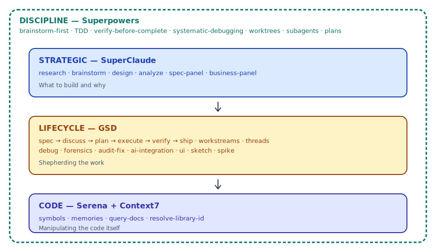

# Claude Stack

**The definitive guide to orchestrating AI-assisted development with Claude Code.**

> You installed Claude Code. Then GSD for lifecycle management. SuperClaude for strategic thinking. Serena for code intelligence. Context7 for docs. Maybe Mysti for VSCode.
>
> Now you have **100+ commands** across 7 tools and no idea how they fit together.
>
> **This guide is the missing manual.**

<p align="center">
  
</p>

**Philosophy**: GSD is the spine (lifecycle + state). SC is the brain (thinking + analysis). Serena is the hands (code navigation + editing). Context7 is the library (live docs). Playwright is the eyes (browser testing). Mysti is the bridge (VSCode multi-agent orchestration).

---

## Quick Start

### 1. Install the Prerequisites

| Component | Install | Purpose |
|-----------|---------|---------|
| **Claude Code** | `npm install -g @anthropic-ai/claude-code` | Core AI agent CLI |
| **GSD** | [Installation guide](https://github.com/gsd-build/get-shit-done) | Project lifecycle management |
| **SuperClaude** | [Installation guide](https://github.com/NomenAK/SuperClaude) | Strategic thinking skills |
| **Serena MCP** | [Configure in MCP settings](https://github.com/oraios/serena) | Semantic code intelligence |
| **Context7 MCP** | [Configure in MCP settings](https://github.com/upstash/context7) | Library documentation |

Optional: [Mysti](https://github.com/DeepMyst/Mysti) (VSCode), [Playwright MCP](https://github.com/microsoft/playwright-mcp), [Sequential Thinking MCP](https://github.com/modelcontextprotocol/servers/tree/main/src/sequentialthinking), [nWave](https://github.com/nWave-ai/nWave) (SDLC methodology)

### 2. Run the Setup Wizard

```bash
# Interactive setup — detects installed tools, picks a profile, copies configs
bash <(curl -fsSL https://raw.githubusercontent.com/effeuteha/claude-stack/main/setup.sh)
```

Or manually copy configs:
```bash
cp examples/settings.json .claude/settings.json
cp examples/mcp.json .mcp.json
cp examples/claude-md/CLAUDE.md CLAUDE.md
```

### 3. Learn the Golden Path

```bash
/gsd:progress                    # Where am I?
/gsd:discuss-phase N             # Share vision for next phase
/gsd:plan-phase N                # Create plan
/sc:spec-panel .planning/...     # Review plan (don't skip!)
/gsd:execute-phase N             # Build it
/sc:analyze                      # Code quality scan
/gsd:verify-work N               # User acceptance testing
```

### 4. Start Building

Read the [full workflow guide](docs/05-workflow-phases.md), follow the [walkthrough](docs/walkthrough-api-feature.md), or use the [decision tree](#which-tool-should-i-use) below.

> **New here?** Start with the [Stack Profiles](docs/00-getting-started.md) to pick the right level of tooling for you — from 3-tool minimal to 10+ tool full stack.

---

## Which Tool Should I Use?

```
Don't know which tool?                 -> /gsd:do or /sc:recommend
Need to think about WHAT to build?     -> SC (brainstorm, business-panel, research)
Need two AI models to debate it?       -> Mysti Brainstorm (Debate/Red-Team)
Need to PLAN how to build it?          -> GSD (discuss, plan-phase)
Need to REVIEW a plan or spec?         -> SC (spec-panel)
Need to BUILD it?                      -> GSD (execute-phase) or SC (implement)
Need to BUILD it all hands-free?       -> GSD (autonomous)
Need to CHECK code quality?            -> SC (analyze, test)
Need to VERIFY it works?              -> GSD (verify-work) + Playwright (on demand)
Need to UNDERSTAND existing code?      -> Serena (find_symbol, get_symbols_overview)
Need to LOOK UP library docs?          -> Context7 (resolve-library-id, query-docs)
Need to REASON through complexity?     -> Sequential Thinking
Need to FIX a bug?                     -> GSD (debug) or SC (troubleshoot)
Need a QUICK one-off task?             -> GSD (quick) or SC (task)
Need to REVIEW a PR?                   -> code-review:code-review
Need to BUILD UI?                      -> frontend-design:frontend-design
Need to SET UP automations?            -> claude-code-setup
```

---

## Documentation

### Start Here

| Guide | What You'll Learn |
|-------|-------------------|
| [**Getting Started — Stack Profiles**](docs/00-getting-started.md) | Pick your profile (Minimal/Standard/Full/VSCode-First) and set up in 10 minutes |
| [**Walkthrough: API Feature End-to-End**](docs/walkthrough-api-feature.md) | See the full workflow in action on a real feature (~35 min, start to finish) |
| [**Troubleshooting**](docs/troubleshooting.md) | Common problems and how to fix them |

### Foundations

| Guide | What You'll Learn |
|-------|-------------------|
| [Architecture Overview](docs/01-architecture.md) | How the tools connect, data flow, the big picture |
| [Claude Code Internals](docs/02-claude-code-internals.md) | CLAUDE.md loading, 4 memory systems, settings hierarchy, hooks, commands vs skills vs agents |
| [Context Discipline](docs/03-context-discipline.md) | Token management, when to compact/clear, context-efficient patterns |
| [Task Routing](docs/04-task-routing.md) | Different workflows for features, bugs, refactors + rigor scaling |

### The Workflow

| Guide | What You'll Learn |
|-------|-------------------|
| [Workflow Phases (0-7)](docs/05-workflow-phases.md) | The complete phase lifecycle from bootstrap to milestone completion |
| [Quality Scaling](docs/06-quality-scaling.md) | Reviewer pattern, git hotspots, mutation testing, cross-model review |
| [Knowledge Management](docs/07-knowledge-management.md) | Codebase mapping, indexing, Serena memories, when to refresh |
| [Cross-Cutting Workflows](docs/08-cross-cutting-workflows.md) | Debugging, ideas, UI dev, ML, parallelization, automation |
| [Session Management](docs/09-session-management.md) | Start, pause, resume, parallel development, agent teams |
| [Mysti + VSCode](docs/10-mysti-vscode.md) | Multi-agent brainstorm, @-mentions, personas, when to use GUI vs CLI |

### Reference

| Guide | What You'll Learn |
|-------|-------------------|
| [Tool Responsibility Matrix](reference/tool-matrix.md) | Primary vs secondary tool for every need |
| [Quick Reference](reference/quick-reference.md) | Golden path, autonomous path, SC flags, decision tree |
| [Tool Inventory](reference/tool-inventory.md) | Complete catalog: ~38 GSD + ~30 SC + 14 Superpowers + 6 plugins + 5 native + 4 MCP |
| [Prompting Patterns](docs/11-prompting-patterns.md) | Effective prompting techniques from Claude Code's creator and power users |
| [Anti-Patterns](docs/12-anti-patterns.md) | 22 mistakes to avoid and what to do instead |

### Examples

| File | Purpose |
|------|---------|
| [settings.json](examples/settings.json) | Team-ready Claude Code settings with permission wildcards |
| [settings.local.json](examples/settings.local.json) | Personal settings template (gitignored) |
| [mcp.json](examples/mcp.json) | Recommended MCP server configuration |
| [CLAUDE.md](examples/claude-md/CLAUDE.md) | Annotated template with filled-in example |
| [rules/](examples/rules/) | Example `.claude/rules/` modular rule files |
| [hooks/](examples/hooks/) | PostToolUse auto-format and lint hooks |
| [commands/](examples/commands/) | Example custom slash commands |

### Cheatsheets

| File | Purpose |
|------|---------|
| [SC Flags](cheatsheets/sc-flags.md) | SuperClaude flags quick reference |

---

## Tool Counts

| Component | Commands/Skills | Status |
|-----------|----------------|--------|
| GSD | ~38 commands | Required |
| SuperClaude | ~30 commands | Required |
| Superpowers | 14 skills (+3 aliases) | Required |
| Plugins | 6 plugins | Required |
| Claude Code Native | 5 skills | Built-in |
| MCP Servers | 4 servers | Required (2) / Optional (2) |
| Mysti | 12 providers, 16 personas, 12 skills | Optional |
| **Total** | **100+** | |

---

## Credits & Related Resources

This guide synthesizes patterns from:

| Resource | What It Covers |
|----------|----------------|
| [claude-code-best-practice](https://github.com/shanraisshan/claude-code-best-practice) | Comprehensive Claude Code tips, settings, hooks, memory patterns |
| [GSD](https://github.com/gsd-build/get-shit-done) | Project lifecycle management for Claude Code |
| [SuperClaude](https://github.com/NomenAK/SuperClaude) | Strategic thinking and analysis skills |
| [Superpowers](https://github.com/obra/superpowers) | Discipline-enforcing workflow skills |
| [Mysti](https://github.com/DeepMyst/Mysti) | Multi-agent VSCode orchestrator |
| [nWave](https://github.com/nWave-ai/nWave) | Structured SDLC methodology with TDD enforcement |
| [Serena](https://github.com/oraios/serena) | Semantic code intelligence MCP server |
| [Context7](https://github.com/upstash/context7) | Library documentation MCP server |

---

## Contributing

See [CONTRIBUTING.md](CONTRIBUTING.md) for how to contribute. PRs welcome for:
- New workflow patterns you've discovered
- Tool integrations we haven't covered
- Example configs for specific tech stacks
- Corrections and improvements

---

## License

MIT

---

*Built by developers who got tired of having 100 tools and no manual.*
